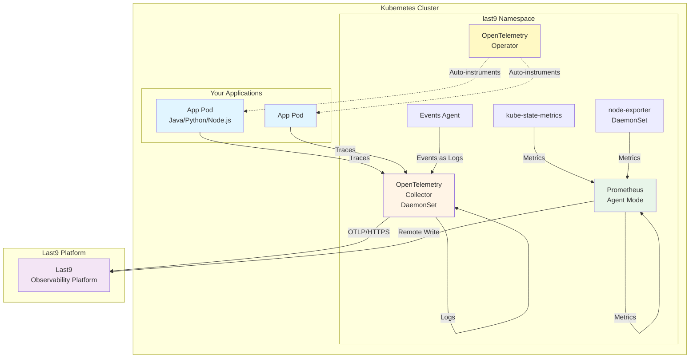

<p align="center">
  
  <h1 align="center">Last9 Kubernetes Observability Installer</h1>
</p>

<p align="center">
  <strong>One-command installation of complete OpenTelemetry observability stack for Kubernetes</strong>
  <br>
  <em>Logs • Traces • Metrics • Events with Auto-Instrumentation</em>
</p>

<p align="center">
  <a href="LICENSE"></a>
  <a href="https://github.com/last9/last9-k8s-observability-installer/releases"></a>
  <a href="https://github.com/last9/last9-k8s-observability-installer/stargazers"></a>
  <a href="https://last9.io/docs"></a>
  
  
</p>

---

Automated setup script for deploying a complete observability stack—OpenTelemetry Operator, Collector, Kubernetes monitoring, and Events collection—to your Kubernetes cluster with Last9 integration.

## Table of Contents

- [Why Use This Installer?](#why-use-this-installer)
- [Features](#features)
- [What Gets Installed](#what-gets-installed)
- [Prerequisites](#prerequisites)
- [Quick Start](#quick-start)
- [Installation Options](#installation-options)
- [Advanced Configuration](#advanced-configuration)
- [Auto-Instrumentation](#auto-instrumentation)
- [Verification](#verification)
- [Troubleshooting](#troubleshooting)
- [Uninstallation](#uninstallation)
- [FAQ](#faq)

## Why Use This Installer?

| Feature | Manual Setup | Last9 Installer |
|---------|-------------|-----------------|
| Installation Time | 2-3 hours | **3-5 minutes** |
| Commands Required | 15+ commands | **1 command** |
| Configuration Files | 5+ files to edit | **Zero** (automated) |
| Auto-instrumentation | Manual setup | **Pre-configured** |
| Kubernetes Events | Separate install | **Included** |
| Tolerations Support | Manual YAML edits | **Command-line flag** |
| Cluster Detection | Manual config | **Automatic** |
| Uninstall | Complex cleanup | **1 command** |

## Features

- ✅ **One-command installation** - Deploy everything with a single command
- ✅ **Flexible deployment options** - Install only what you need (logs, traces, metrics, events)
- ✅ **Auto-instrumentation** - Automatic instrumentation for Java, Python, Node.js, and Go (via eBPF)
- ✅ **Kubernetes monitoring** - Full cluster observability with kube-prometheus-stack
- ✅ **Events collection** - Capture and forward Kubernetes events
- ✅ **Cluster identification** - Automatic cluster name detection and attribution
- ✅ **Tolerations support** - Deploy on tainted nodes (control-plane, spot instances, etc.)
- ✅ **Environment customization** - Override deployment environment and cluster name

## Architecture

The installer deploys a complete observability stack that collects, processes, and forwards telemetry data to Last9:



**Data Flow:**
1. **Traces**: Apps → OpenTelemetry Collector → Last9
2. **Logs**: Container logs → OpenTelemetry Collector → Last9
3. **Metrics**: Prometheus scrapes → Remote Write → Last9
4. **Events**: Kubernetes API → Events Agent → Last9

## What Gets Installed

Depending on your installation option, the following components are deployed in the `last9` namespace:

### Full Installation Components

| Component | Version | Purpose | Data Types |
|-----------|---------|---------|------------|
| **OpenTelemetry Operator** | v0.92.1 | Manages auto-instrumentation of applications | Traces |
| **OpenTelemetry Collector** | v0.126.0 | Aggregates and forwards telemetry data | Logs, Traces |
| **Kube-Prometheus-Stack** | v75.15.1 | Collects cluster and application metrics | Metrics |
| └─ Prometheus (Agent Mode) | - | Optimized for remote write | Metrics |
| └─ kube-state-metrics | - | Kubernetes object metrics | Metrics |
| └─ node-exporter | - | Node hardware/OS metrics | Metrics |
| **Last9 Kube Events Agent** | v0.125.0 | Captures Kubernetes cluster events | Events (as logs) |
| **Instrumentation Object** | - | Auto-instrumentation configuration | Config |

### Resource Requirements

**Total cluster resources (full installation):**
- Memory: ~1.5GB across all components
- CPU: ~0.5 cores across all components
- Storage: Minimal (agent mode, no local persistence)

## Prerequisites

### Required Tools

Before you begin, ensure you have:

- **Kubernetes cluster** (v1.19+) with `kubectl` access
- **Helm** package manager (v3.9+)
- **Cluster admin permissions** for creating namespaces and deploying operators

### Last9 Account & Credentials

You'll need credentials from your **Last9 account**. If you don't have an account yet, [sign up for free](https://last9.io/).

#### Step 1: Get Your Last9 Credentials

Follow the [Last9 Getting Started Guide](https://last9.io/docs/onboard/) to obtain your credentials.

#### Step 2: Gather Required Information

Depending on what you want to install, you'll need:

<details>
<summary><b>📊 For Logs & Traces Collection</b></summary>

- **OTLP Endpoint**: Your Last9 OTLP endpoint URL
  - Example: `https://otlp.last9.io/v1/traces`
  - Find at: Last9 Dashboard → Settings → OTLP Integration

- **Auth Token**: Your base64-encoded authentication token
  - Format: `Basic <base64-encoded-credentials>`
  - Find at: Last9 Dashboard → Settings → OTLP Integration

📖 **Reference**: [OpenTelemetry Collector Setup](https://last9.io/docs/integrations/observability/opentelemetry-collector/)

</details>

<details>
<summary><b>📈 For Cluster Monitoring (Metrics)</b></summary>

- **Monitoring Endpoint**: Prometheus remote write endpoint
  - Example: `https://your-cluster-id.last9.io/api/v1/write`
  - Find at: Last9 Dashboard → Settings → Prometheus Remote Write

- **Username**: Your Last9 Cluster ID
  - Find at: Last9 Dashboard → Settings → Prometheus Remote Write

- **Password**: Your Last9 Write Token
  - Find at: Last9 Dashboard → Settings → Prometheus Remote Write

📖 **Reference**: [Kubernetes Cluster Monitoring](https://last9.io/docs/integrations/containers-and-k8s/kubernetes-cluster-monitoring/)

</details>

<details>
<summary><b>🔔 For Kubernetes Events</b></summary>

Uses the same credentials as Logs & Traces above:
- OTLP Endpoint
- Auth Token

📖 **Reference**: [Kubernetes Events Integration](https://last9.io/docs/integrations/containers-and-k8s/kubernetes-events/)

</details>

### Quick Credential Check

Run this checklist before installation:

```bash
# ✓ Check kubectl access
kubectl cluster-info

# ✓ Check Helm version
helm version

# ✓ Verify cluster admin access
kubectl auth can-i create namespaces

# ✓ Have your Last9 credentials ready:
# - [ ] OTLP endpoint URL
# - [ ] Auth token (Base64 encoded)
# - [ ] Monitoring endpoint (for metrics)
# - [ ] Cluster ID (username)
# - [ ] Write token (password)
```

## Quick Start

### Option 1: Install Everything (Recommended)

This installs the **complete observability stack**: OpenTelemetry Operator, Collector, Kubernetes monitoring stack, and Events agent.

**What you'll get:** ✅ Logs ✅ Traces ✅ Metrics ✅ Events ✅ Auto-instrumentation

```bash
./last9-otel-setup.sh \
  token="Basic <your-base64-token>" \
  endpoint="<your-otlp-endpoint>" \
  monitoring-endpoint="<your-metrics-endpoint>" \
  username="<your-cluster-id>" \
  password="<your-write-token>"
```

**Example with sample values:**

```bash
./last9-otel-setup.sh \
  token="Basic YWxhZGRpbjpvcGVuc2VzYW1l" \
  endpoint="https://otlp.last9.io/v1/traces" \
  monitoring-endpoint="https://prod-cluster-123.last9.io/api/v1/write" \
  username="cluster-abc123" \
  password="write_token_xyz789"
```

**⏱️ Installation time:** 3-5 minutes

**Expected output:**
```
[INFO] ✓ Namespace 'last9' created
[INFO] ✓ OpenTelemetry Operator installed
[INFO] ✓ OpenTelemetry Collector deployed
[INFO] ✓ Kubernetes monitoring stack installed
[INFO] ✓ Events agent deployed
[INFO] ✓ Auto-instrumentation configured
[INFO] 🎉 Installation complete!
```

### Quick Install (One-liner)

```bash
curl -fsSL https://raw.githubusercontent.com/last9/last9-k8s-observability-installer/main/last9-otel-setup.sh | bash -s -- \
  token="Basic <your-token>" \
  endpoint="<your-otlp-endpoint>" \
  monitoring-endpoint="<your-metrics-endpoint>" \
  username="<user>" \
  password="<pass>"
```

## Installation Options

### Option 2: Traces Only (Operator + Collector)

For applications that need distributed tracing:

```bash
./last9-otel-setup.sh operator-only \
  token="Basic <your-token>" \
  endpoint="<your-otlp-endpoint>"
```

### Option 3: Logs Only (Collector without Operator)

For log collection use cases:

```bash
./last9-otel-setup.sh logs-only \
  token="Basic <your-token>" \
  endpoint="<your-otlp-endpoint>"
```

### Option 4: Metrics Only (Kubernetes Monitoring)

For cluster metrics and monitoring:

```bash
./last9-otel-setup.sh monitoring-only \
  monitoring-endpoint="<your-metrics-endpoint>" \
  username="<your-username>" \
  password="<your-password>"
```

### Option 5: Kubernetes Events Only

For Kubernetes events collection:

```bash
./last9-otel-setup.sh events-only \
  endpoint="<your-otlp-endpoint>" \
  token="Basic <your-base64-token>" \
  monitoring-endpoint="<your-metrics-endpoint>"
```

## Advanced Configuration

### Override Cluster Name

```bash
./last9-otel-setup.sh \
  token="..." \
  endpoint="..." \
  cluster="prod-us-east-1"
```

If not provided, the cluster name is auto-detected from `kubectl config current-context`.

### Set Deployment Environment

```bash
./last9-otel-setup.sh \
  token="..." \
  endpoint="..." \
  env="production"
```

Default: `staging` for collector, `local` for auto-instrumentation.

### Deploy with Tolerations

For deploying on nodes with taints (e.g., control-plane, monitoring nodes):

```bash
./last9-otel-setup.sh \
  token="..." \
  endpoint="..." \
  tolerations-file=/path/to/tolerations.yaml
```

**Example tolerations files** are provided in the `examples/` directory:
- `tolerations-all-nodes.yaml` - Deploy on all nodes including control-plane
- `tolerations-monitoring-nodes.yaml` - Deploy on dedicated monitoring nodes
- `tolerations-spot-instances.yaml` - Deploy on spot/preemptible instances
- `tolerations-multi-taint.yaml` - Handle multiple taints
- `tolerations-nodeSelector-only.yaml` - Use nodeSelector without tolerations

## Configuration Files

| File | Description |
|------|-------------|
| `last9-otel-collector-values.yaml` | OpenTelemetry Collector configuration for logs and traces |
| `k8s-monitoring-values.yaml` | Kube-prometheus-stack configuration for metrics |
| `last9-kube-events-agent-values.yaml` | Events collection agent configuration |
| `collector-svc.yaml` | Collector service for application instrumentation |
| `instrumentation.yaml` | Auto-instrumentation configuration |
| `deploy.yaml` | Sample application deployment with auto-instrumentation |
| `tolerations.yaml` | Sample tolerations configuration |

### Placeholders

The following placeholders are automatically replaced during installation:

- `{{AUTH_TOKEN}}` - Your Last9 authorization token
- `{{OTEL_ENDPOINT}}` - Your OTEL endpoint URL
- `{{MONITORING_ENDPOINT}}` - Your metrics endpoint URL

## Uninstallation

### Uninstall Everything

```bash
./last9-otel-setup.sh uninstall-all
```

### Uninstall Specific Components

```bash
# Uninstall only monitoring stack
./last9-otel-setup.sh uninstall function="uninstall_last9_monitoring"

# Uninstall only events agent
./last9-otel-setup.sh uninstall function="uninstall_events_agent"

# Uninstall OpenTelemetry components (operator + collector)
./last9-otel-setup.sh uninstall
```

## Verification

After installation, verify the deployment:

```bash
# Check all pods in last9 namespace
kubectl get pods -n last9

# Check collector logs
kubectl logs -n last9 -l app.kubernetes.io/name=opentelemetry-collector

# Check monitoring stack
kubectl get prometheus -n last9

# Check events agent
kubectl get pods -n last9 -l app.kubernetes.io/name=last9-kube-events-agent
```

## Auto-Instrumentation

The script automatically sets up instrumentation for:

- ☕ **Java** - Automatic OTLP export (bytecode instrumentation)
- 🐍 **Python** - Automatic OTLP export (bytecode instrumentation)
- 🟢 **Node.js** - Automatic OTLP export (runtime hooks)
- 🐹 **Go** - Automatic OTLP export (eBPF instrumentation)

**Note:** Go instrumentation uses eBPF technology. See [examples/go-app-example.md](examples/go-app-example.md) for requirements and setup. For non-Kubernetes Go deployments, use the [Last9 Go SDK](https://github.com/last9/go-agent).

### How to Enable Auto-Instrumentation

Add the appropriate annotation to your deployment's pod template metadata:

```yaml
apiVersion: apps/v1
kind: Deployment
metadata:
  name: my-app
spec:
  template:
    metadata:
      annotations:
        # For Java applications:
        instrumentation.opentelemetry.io/inject-java: "true"

        # For Python applications:
        instrumentation.opentelemetry.io/inject-python: "true"

        # For Node.js applications:
        instrumentation.opentelemetry.io/inject-nodejs: "true"
```

**Example:** See `deploy.yaml` for a complete working example.

**📖 Learn more:** [OpenTelemetry Auto-Instrumentation Guide](https://last9.io/docs/integrations/containers-and-k8s/kubernetes-operator/)
## Troubleshooting

### Common Issues and Solutions

#### 1. Collector Pods in CrashLoopBackOff

**Symptoms:**
```bash
$ kubectl get pods -n last9
NAME                                         READY   STATUS             RESTARTS   AGE
opentelemetry-collector-agent-xxxxx          0/1     CrashLoopBackOff   5          5m
```

**Possible Causes:**
- Invalid authentication credentials
- Incorrect endpoint URL
- Network connectivity issues

**Solutions:**
```bash
# Check collector logs
kubectl logs -n last9 -l app.kubernetes.io/name=opentelemetry-collector --tail=50

# Common error patterns:
# - "401 Unauthorized" → Check your auth token
# - "connection refused" → Verify endpoint URL
# - "certificate" errors → Check TLS/SSL configuration

# Verify credentials are correctly set
kubectl get secret -n last9 -o yaml | grep -A 5 "token\|endpoint"

# Re-run installation with correct credentials
./last9-otel-setup.sh uninstall-all
./last9-otel-setup.sh [with correct credentials]
```

#### 2. No Traces Appearing in Last9

**Symptoms:** Application is running but no traces visible in Last9 dashboard.

**Solutions:**

```bash
# Step 1: Verify annotation is applied correctly
kubectl get pod <your-pod-name> -n <namespace> -o yaml | grep -A 2 "annotations:"

# Should see: instrumentation.opentelemetry.io/inject-java: "true"

# Step 2: Check if pod was restarted after annotation
kubectl get pod <your-pod-name> -n <namespace> -o jsonpath='{.metadata.creationTimestamp}'

# If pod existed before annotation, restart it:
kubectl rollout restart deployment <your-deployment> -n <namespace>

# Step 3: Verify instrumentation object exists
kubectl get instrumentation -n last9
kubectl describe instrumentation l9-instrumentation -n last9

# Step 4: Check collector service is reachable
kubectl get svc -n last9 otel-collector-service

# Step 5: Test connectivity from your app namespace
kubectl run -it --rm debug --image=busybox --restart=Never -n <your-namespace> -- \
  wget -O- http://otel-collector-service.last9.svc.cluster.local:4318

# Should return 404 (service is up) or connection
```

#### 3. Helm Release Already Exists

**Symptoms:**
```
Error: release "last9-opentelemetry-collector" already exists
```

**Solutions:**
```bash
# Option 1: Uninstall completely and reinstall
./last9-otel-setup.sh uninstall-all
./last9-otel-setup.sh [your installation command]

# Option 2: Manually remove the specific release
helm uninstall last9-opentelemetry-collector -n last9
helm uninstall opentelemetry-operator -n last9
helm uninstall last9-k8s-monitoring -n last9

# Then reinstall
./last9-otel-setup.sh [your installation command]
```

#### 4. Monitoring Stack Pods Not Starting

**Symptoms:** Prometheus or node-exporter pods stuck in Pending state.

**Solutions:**
```bash
# Check pod status and events
kubectl get pods -n last9
kubectl describe pod <pod-name> -n last9

# Common issues:
# - Insufficient resources → Scale down other workloads or add nodes
# - Node selectors not matching → Use tolerations (see Advanced Configuration)
# - Storage class issues → Verify StorageClass exists

# Check node resources
kubectl top nodes

# If running on tainted nodes, use tolerations:
./last9-otel-setup.sh \
  tolerations-file=examples/tolerations-all-nodes.yaml \
  [other parameters]
```

#### 5. Events Not Appearing

**Symptoms:** Kubernetes events not showing up in Last9.

**Solutions:**
```bash
# Verify events agent is running
kubectl get pods -n last9 -l app.kubernetes.io/name=last9-kube-events-agent

# Check events agent logs
kubectl logs -n last9 -l app.kubernetes.io/name=last9-kube-events-agent --tail=100

# Generate test event
kubectl run test-event --image=nginx --restart=Never
kubectl delete pod test-event

# Check if events are being captured
kubectl logs -n last9 -l app.kubernetes.io/name=last9-kube-events-agent | grep -i "test-event"
```

#### 6. Permission Denied Errors

**Symptoms:**
```
Error: RBAC: permissions denied
```

**Solutions:**
```bash
# Verify you have cluster-admin permissions
kubectl auth can-i '*' '*' --all-namespaces

# If not, ask your cluster administrator to grant you permissions or run:
kubectl create clusterrolebinding cluster-admin-binding \
  --clusterrole=cluster-admin \
  --user=$(kubectl config view --minify -o jsonpath='{.users[0].name}')
```

### Getting Help

If you're still experiencing issues:

1. **Check the logs:**
   ```bash
   # All Last9 components
   kubectl logs -n last9 --all-containers=true --tail=100

   # Specific component
   kubectl logs -n last9 -l app.kubernetes.io/name=opentelemetry-collector
   ```

2. **Verify configuration:**
   ```bash
   # View applied configuration
   kubectl get cm -n last9
   kubectl get instrumentation -n last9 -o yaml
   ```

3. **Review Last9 documentation:**
   - [OpenTelemetry Troubleshooting](https://last9.io/docs/integrations/observability/opentelemetry-collector/#troubleshooting)
   - [Kubernetes Monitoring Troubleshooting](https://last9.io/docs/integrations/containers-and-k8s/kubernetes-cluster-monitoring/#troubleshooting)

4. **Contact support:**
   - Email: support@last9.io
   - [Join Last9 Community Slack](https://last9.io/slack)
   - [GitHub Issues](https://github.com/last9/last9-k8s-observability-installer/issues)

---

## FAQ

### General Questions

**Q: Can I use this with an existing Prometheus installation?**

A: Yes! Use one of these approaches:
- Skip monitoring: `./last9-otel-setup.sh operator-only [params]`
- Or don't provide `monitoring-endpoint`, `username`, and `password` parameters

**Q: Will this interfere with my existing OpenTelemetry setup?**

A: The installation is namespaced to `last9`, so it won't conflict with operators or collectors in other namespaces. However, if you have cluster-wide resources (like CRDs), they will be shared.

**Q: How much does this cost in terms of cluster resources?**

A: Full installation uses approximately:
- **Memory:** ~1.5GB total
- **CPU:** ~0.5 cores total
- **Storage:** Minimal (agent mode, no local persistence)

Individual components:
- OpenTelemetry Collector: ~200MB memory, ~0.1 CPU
- Prometheus (agent): ~500MB memory, ~0.2 CPU
- node-exporter: ~50MB per node
- Events agent: ~100MB memory, ~0.05 CPU

**Q: Can I customize the OpenTelemetry Collector configuration?**

A: Yes! After installation, edit the values:
```bash
# Edit collector configuration
kubectl edit cm -n last9 last9-opentelemetry-collector

# Or update via Helm
helm get values last9-opentelemetry-collector -n last9 > my-values.yaml
# Edit my-values.yaml
helm upgrade last9-opentelemetry-collector open-telemetry/opentelemetry-collector \
  -n last9 -f my-values.yaml
```

**Q: Is this production-ready?**

A: Yes! This installer uses:
- Official OpenTelemetry Helm charts
- Stable chart versions (tested and verified)
- Industry-standard configurations
- Agent mode for efficient resource usage

Many organizations use this in production. Always test in a non-production environment first.

### Auto-Instrumentation Questions

**Q: How do I enable auto-instrumentation for my application?**

A: Add the annotation to your deployment's pod template:
```yaml
annotations:
  instrumentation.opentelemetry.io/inject-java: "true"      # For Java
  instrumentation.opentelemetry.io/inject-python: "true"    # For Python
  instrumentation.opentelemetry.io/inject-nodejs: "true"    # For Node.js
  instrumentation.opentelemetry.io/inject-go: "true"        # For Go (eBPF)
```

Then restart your pod: `kubectl rollout restart deployment <name> -n <namespace>`

**Q: Do I need to modify my application code?**

A: No! Auto-instrumentation works without code changes for:
- ☕ **Java** (any JVM-based app)
- 🐍 **Python**
- 📦 **Node.js**
- 🐹 **Go** (via eBPF - Linux only, requires Go 1.17+)

**Note:** Go auto-instrumentation uses eBPF technology and requires:
- Linux kernel 4.4+
- `shareProcessNamespace: true` in pod spec
- `OTEL_GO_AUTO_TARGET_EXE` environment variable set to your binary path

See [examples/go-app-example.md](examples/go-app-example.md) for a complete Go example.

**Alternative for Go:** Use the [Last9 Go SDK](https://github.com/last9/go-agent) for non-Kubernetes environments or when eBPF is not available. The SDK requires minimal code changes (2 lines) and works on VMs, Lambda, and local development.

**Q: Can I customize the instrumentation settings?**

A: Yes! Edit the instrumentation object:
```bash
kubectl edit instrumentation l9-instrumentation -n last9
```

Common customizations:
- Sampling rate: Change `sampler.argument` (default: "1.0" = 100%)
- Environment: Change `OTEL_RESOURCE_ATTRIBUTES` value
- Exporters: Modify endpoint URLs

**Q: What if my app is in a different namespace?**

A: The instrumentation object needs to be in the same namespace as your application. Two options:

1. **Reference the Last9 namespace instrumentation:**
   ```yaml
   annotations:
     instrumentation.opentelemetry.io/inject-java: "last9/l9-instrumentation"
   ```

2. **Copy the instrumentation object to your namespace:**
   ```bash
   kubectl get instrumentation l9-instrumentation -n last9 -o yaml | \
     sed 's/namespace: last9/namespace: my-namespace/' | \
     kubectl apply -f -
   ```

### Deployment Questions

**Q: Can I run this on EKS/GKE/AKS?**

A: Yes! This works on any Kubernetes 1.19+ cluster:
- ✅ Amazon EKS
- ✅ Google GKE
- ✅ Azure AKS
- ✅ Self-hosted Kubernetes
- ✅ Minikube / Kind (for testing)

**Q: How do I deploy on nodes with taints?**

A: Use the `tolerations-file` parameter:
```bash
./last9-otel-setup.sh \
  tolerations-file=examples/tolerations-all-nodes.yaml \
  [other parameters]
```

See the `examples/` directory for various toleration scenarios.

**Q: Can I change the namespace from 'last9'?**

A: The namespace is hardcoded to `last9` in the current version. To use a different namespace, you'll need to modify the script and configuration files.

**Q: How do I update to a newer version?**

A: Re-run the installation command:
```bash
./last9-otel-setup.sh [same parameters as original installation]
```

Helm will upgrade existing releases to the versions specified in the script.

### Data and Privacy Questions

**Q: What data is sent to Last9?**

A: Depending on your installation:
- **Traces:** Application spans and traces
- **Logs:** Container logs from all pods
- **Metrics:** Cluster, node, and pod metrics
- **Events:** Kubernetes cluster events

No sensitive data (secrets, environment variables, etc.) is collected by default.

**Q: Can I filter what logs/metrics are sent?**

A: Yes! Edit the collector configuration to add processors:
```bash
kubectl edit cm -n last9 last9-opentelemetry-collector
```

Add filters in the processors section. See [OpenTelemetry Processor documentation](https://opentelemetry.io/docs/collector/configuration/#processors).

**Q: Is data encrypted in transit?**

A: Yes! All data is sent over HTTPS/TLS to Last9 endpoints.

### Troubleshooting Questions

**Q: Why aren't my traces showing up?**

A: Check:
1. ✅ Annotation is present: `kubectl get pod <name> -o yaml | grep instrumentation`
2. ✅ Pod was restarted after adding annotation
3. ✅ Collector is running: `kubectl get pods -n last9`
4. ✅ Credentials are correct (check collector logs)

See the [Troubleshooting](#troubleshooting) section for detailed steps.

**Q: How do I completely remove everything?**

A: Run the uninstall command:
```bash
./last9-otel-setup.sh uninstall-all
```

This removes:
- All Helm releases
- The `last9` namespace
- CRDs and cluster-wide resources

---

## Contributing

We welcome contributions! To contribute:

1. Fork the repository
2. Create a feature branch: `git checkout -b feature/my-feature`
3. Make your changes
4. Test thoroughly
5. Submit a pull request

**Areas where we need help:**
- Additional language support (Ruby, .NET, etc.)
- More toleration examples
- Documentation improvements
- Bug reports and fixes

## License

This project is licensed under the Apache License 2.0 - see the [LICENSE](LICENSE) file for details.

## Acknowledgments

Built with:
- [OpenTelemetry](https://opentelemetry.io/) - Observability framework
- [OpenTelemetry Operator](https://github.com/open-telemetry/opentelemetry-operator) - Kubernetes operator
- [Kube-Prometheus-Stack](https://github.com/prometheus-operator/kube-prometheus) - Kubernetes monitoring
- [Last9](https://last9.io/) - Observability platform

## Related Resources

- 📖 [Last9 Documentation](https://last9.io/docs)
- 🎓 [OpenTelemetry Documentation](https://opentelemetry.io/docs/)
- 💬 [Last9 Community Slack](https://last9.io/slack)
- 🐛 [Report Issues](https://github.com/last9/last9-k8s-observability-installer/issues)
- ⭐ [Star this repo](https://github.com/last9/last9-k8s-observability-installer) if you find it useful!

---

<p align="center">
  Made with ❤️ by <a href="https://last9.io">Last9</a>
</p>
